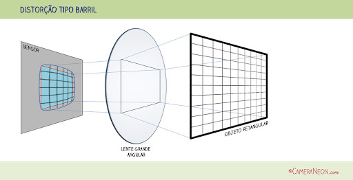

# Como usar OpenCV e Python para calibrar câmeras

## Calibração de Câmeras com OpenCV e Python

### Introdução

A calibração de câmeras é um processo fundamental na visão computacional, que corrige as distorções ópticas geradas pelas lentes. Essas distorções afetam a precisão das medidas feitas a partir de imagens, comprometendo aplicações como mapeamento, medição e reconstrução 3D.

### Tipos de Distorções em Imagens

As lentes podem causar diversos tipos de distorções:

* **Distorção radial**: Linhas retas aparecem curvas na imagem, especialmente próximas às bordas.

<figure><figcaption></figcaption></figure>

* **Distorção tangencial**: Ocorre quando o plano da lente não está perfeitamente paralelo ao plano do sensor da câmera.

<figure><figcaption></figcaption></figure>

Essas distorções precisam ser corrigidas para garantir precisão em análises visuais e medições.

### O que é a Calibração de Câmeras?

A calibração de câmeras consiste em determinar os parâmetros intrínsecos (características internas da câmera, como distância focal e ponto principal) e extrínsecos (posição e orientação da câmera em relação ao objeto capturado).

## Por que acontece a distorção?

A distorção acontece porque as lentes fotográficas têm formatos e propriedades ópticas que desviam a luz de forma desigual ao longo da superfície da lente. As principais razões incluem:

* **Formato Esférico das Lentes:** A maioria das lentes possuem superfícies esféricas que fazem com que os raios de luz, principalmente aqueles que passam longe do centro, sofram desvios desiguais, criando a distorção radial.
* **Desalinhamento Mecânico:** Pequenas imprecisões na montagem das lentes podem causar desalinhamentos que resultam na distorção tangencial.

Essas características físicas das lentes fazem com que pontos retos no mundo real sejam registrados de maneira distorcida nas imagens capturadas. A calibração ajuda a compensar esses desvios, tornando as imagens úteis para análises precisas.

***

### Como Calibrar Câmeras Usando OpenCV e Python

#### Materiais Necessários

* Um tabuleiro de xadrez (padrão conhecido).
* Uma câmera digital.
* Bibliotecas Python: OpenCV e NumPy.

#### Passo a Passo da Calibração

**1. Preparar o Ambiente**

```bash
pip install opencv-python numpy
```

**2. Capturar Imagens do Tabuleiro de Xadrez**

Capture diversas fotos do tabuleiro de xadrez em diferentes ângulos e posições.

**3. Código para Calibração com OpenCV**

```python
import cv2
import numpy as np
import glob

# Parâmetros do tabuleiro
CHECKERBOARD = (7, 6)

# Preparar pontos 3D conhecidos
objp = np.zeros((CHECKERBOARD[0]*CHECKERBOARD[1], 3), np.float32)
objp[:, :2] = np.mgrid[0:CHECKERBOARD[0], 0:CHECKERBOARD[1]].T.reshape(-1, 2)

objpoints = []  # Pontos 3D reais
imgpoints = []  # Pontos 2D nas imagens

images = glob.glob('*.jpg')  # Caminho das imagens

for fname in images:
    img = cv2.imread(fname)
    gray = cv2.cvtColor(img, cv2.COLOR_BGR2GRAY)

    # Encontrar cantos do tabuleiro
    ret, corners = cv2.findChessboardCorners(gray, CHECKERBOARD, None)

    if ret:
        objpoints.append(objp)
        imgpoints.append(corners)

# Calibrar câmera
ret, mtx, dist, rvecs, tvecs = cv2.calibrateCamera(objpoints, imgpoints, gray.shape[::-1], None, None)

print("Matriz da câmera:\n", mtx)
print("Coeficientes de distorção:\n", dist)
```

#### Resultados da Calibração

* **mtx**: matriz da câmera contendo distância focal e o ponto principal.
* **dist**: coeficientes das distorções radial e tangencial.

### Aplicação dos Parâmetros para Correção

Para corrigir imagens:

```python
img_corrigida = cv2.undistort(img, mtx, dist, None, mtx)
cv2.imshow('Imagem Corrigida', img_corrigida)
cv2.waitKey(0)
cv2.destroyAllWindows()
```

### Conclusão

Utilizando OpenCV e Python, é possível realizar a calibração eficiente e precisa de câmeras, possibilitando aplicações mais robustas em visão computacional.
